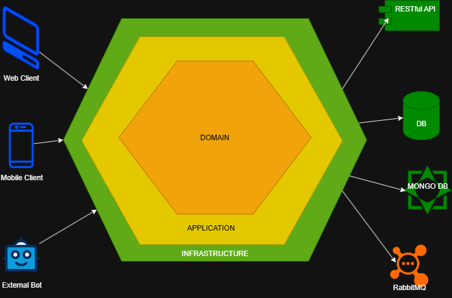
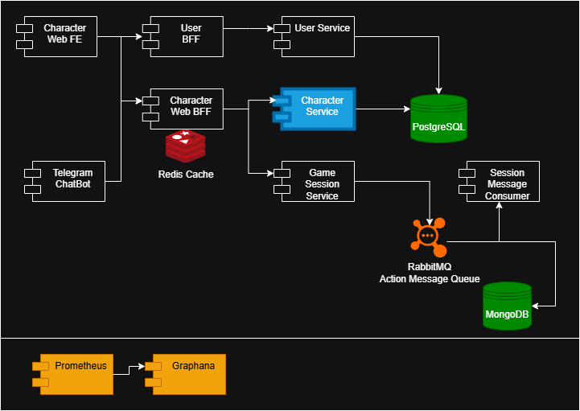

# kanionland-game-session-service
A Java-Spring based project solution for TTRPG focused in logging and tracing sessions actions and user operations. This microservice will be a first step in handling actions over a Game Session, which will be constantly persisted so they can be reviewed and traced. This component will be linked to the Character BFF component, linked with services focused in these purposes.

## Installation

1. Clone the repository:
   ```bash
   git clone

2. Ensure the following prerequisites are installed:
    - Java 11 or higher
    - Maven 3.6 or higher

3. Set the current Spring profile to local:
   Linux/macOS
   ```bash 
   export SPRING_PROFILES_ACTIVE=local
   ```
   Windows
   ```cmd
   set SPRING_PROFILES_ACTIVE=local
   ```

4. Build the project using Maven:
   ```bash
   mvn clean install
   ```
5. Run the application:
   ```bash
   mvn spring-boot:run -Dspring.profiles.active=local
   ```
6. Access the application at `http://localhost:8090`.

## Implementation Details

- This service is a will receive requests from the Character BFF component, interpreting these requests as game session actions (from starting a mission, buying items, changing equipement, interacting with other characters, engaging in a combat, rolling dices, etc.)
- The project is structured using Spring Boot and follows best practices for RESTful API design.
- Hexagonal Architecture principles are applied to ensure maintainability and scalability.
    - This approach is preferred than Clean Architecture as the size of the microservice is not
      expected to hold too many operations or concerns, while still providing a clear separation of
      concerns and a better maintainability.
    - The business logic doesn't represent a high complexity for the system, so using a Clean
      Architecture approach could lead to over-engineering.
    - Hexagonal Architecture is also focused on separation of concerns through ports and adapters,
      bringing easier adaptation to external consumers, services and frameworks.
- Endpoint definition is provided through API First contracts using OpenAPI/Swagger.
- The project includes unit and integration tests to ensure code quality and reliability, relying
  mostly on JUnit and Mockito.

## Scope

- This Microservice will only be in charge of Game session message production and formatting, so the specialized consumers can retrieve said information for further trace and analysis.
- Access, authentication and proper format will be handled by the expected BFFs consuming this service, the JWT token will be passed from the BFF to this service, so the user authentication is performed at this level.
- In contrast, this component will have a series of handles for executing and validating operation
  commands, while integrating directly with the database through JPA repositories
  

## High-level component design

- Following Hexagonal architecture and finding scenarios where Design Patters are suitable for their usage. This component is very straightforward as it will receive requests at **controller** level, apply validations and proper formatting and then send the message to the JMS queue through the **producers**.
- Controllers will be the link to the BFF to perform operations exposed to the users.
- Ports and Adapters will allow decoupling and responsibility separation, making the system easier to adapt to external consumers, services and frameworks.
- Producers will be held responsible for messaging generation and sending to the JMS queue or other message-based solution.